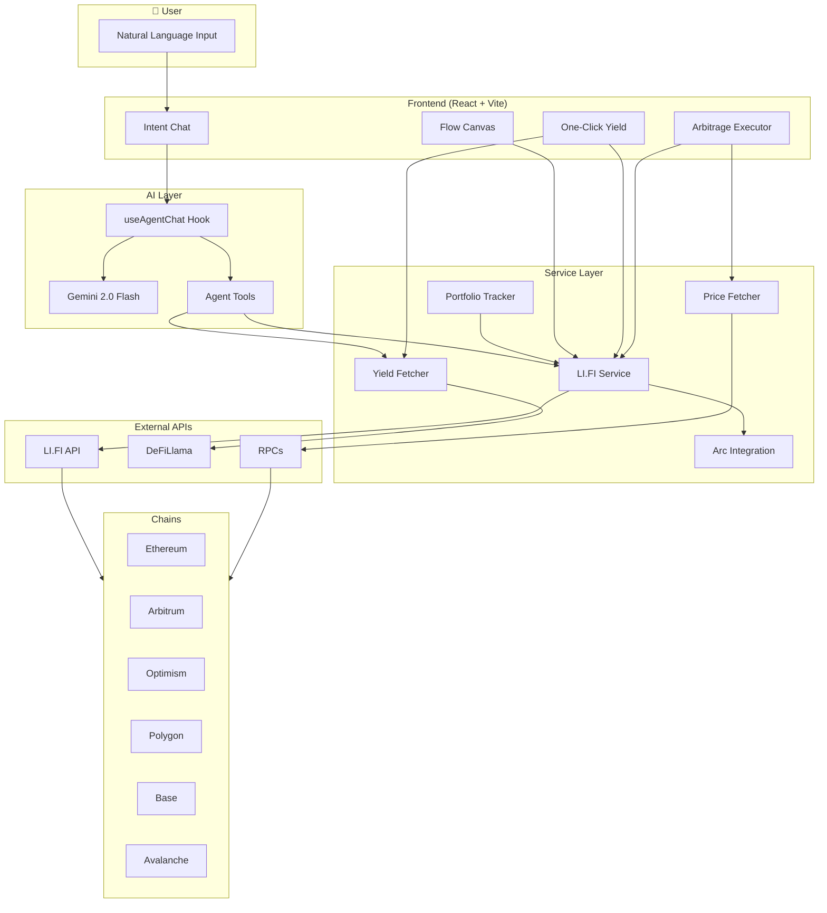
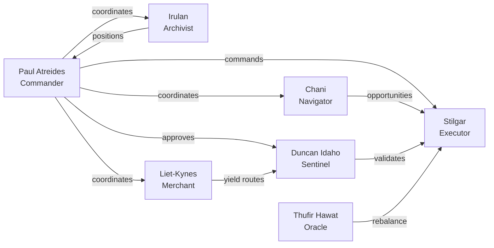

# 🌐 LI.FI Agents Orchestrator

> **AI-Powered Cross-Chain DeFi. Speak naturally. Get it done.**  
> Built for HackMoney 2026 — LI.FI Track

A cross-chain DeFi orchestrator with **7 specialized AI agents** (inspired by Dune characters) that work together to swap, bridge, optimize yields, detect arbitrage, and manage your portfolio across **Ethereum, Arbitrum, Optimism, Polygon, Base, and Avalanche**. Just type what you want—no forms, no jargon.

---

## ✨ What It Does

| You Say | The System Does |
|---------|-----------------|
| *"Check my wallet"* | Fetches your USDC balance across all 6 chains |
| *"Swap 100 USDC from Ethereum to Arbitrum"* | Finds the best route (Arc/CCTP for USDC→USDC), gets a quote |
| *"Move my 50 USDC to Base"* | Bridges via Circle CCTP (native burn/mint) |
| *"Put my USDC where it earns the most"* | Scans DeFiLlama for best APY across Aave, Compound, Morpho, etc. |
| *"Swap my USDC to ETH"* | Uses LI.FI to find best route for token swaps |
| *"Find arbitrage opportunities"* | Compares prices across chains and surfaces profitable gaps |
| *"Make best use of 1 USDC from my wallet"* | Checks balance, yields, and suggests optimal action |

---

## 🎯 Perfect Use Cases

- **Busy DeFi users** — Type a goal, get a quote or action. No clicking through 5 screens.
- **Multi-chain portfolios** — One interface for balances, swaps, and yields across 6 chains.
- **Yield hunters** — Compare APY across protocols (Aave, Compound, Morpho, Yearn…) and chains.
- **Arbitrage scouts** — Spot price differences across chains before executing.
- **Portfolio rebalancers** — Monitor drift and rebalance via LI.FI routes.
- **Bridge users** — USDC→USDC uses Arc (Circle CCTP); other pairs use LI.FI best route.

---

## 🤖 The 7 Agents (Dune-Inspired)

| Agent | Role | What They Do |
|-------|------|--------------|
| **Paul Atreides** | Commander | Coordinates all agents, approves routes, strategic decisions |
| **Chani** | Navigator | Detects arbitrage opportunities across chains |
| **Irulan** | Archivist | Tracks positions, PnL, and historical performance |
| **Liet-Kynes** | Merchant | Finds best yield opportunities (APY) across protocols |
| **Duncan Idaho** | Sentinel | Validates route safety, slippage, and bridge security |
| **Thufir Hawat** | Oracle | Monitors allocations, detects drift, rebalances |
| **Stilgar** | Glitch | Executes LI.FI routes with minimal latency |

---

## 🚀 Quick Start

### Prerequisites

- **Node.js 18+**
- **Google Gemini API Key** — [Get one](https://makersuite.google.com/app/apikey)
- **WalletConnect Project ID** (optional, for wallet integration)

### Installation

```bash
git clone <repository-url>
cd lifi-agents-orchestrator
npm install
```

### Configure

Create `.env` in the project root:

```env
VITE_GEMINI_API_KEY=your_gemini_api_key_here
VITE_WALLET_CONNECT_PROJECT_ID=your_wallet_connect_id  # optional
VITE_LIFI_API_KEY=your_lifi_api_key  # optional - avoids 429 rate limits (200 req/min vs 200 req/2hr)
```

> **LI.FI rate limits**: Without an API key, LI.FI allows ~200 quote requests per 2 hours. You may see "Something went wrong" / 429 errors during heavy use. Get a free API key at [li.fi/plans](https://li.fi/plans/) and set `VITE_LIFI_API_KEY` for 200 req/min. *For production, use a backend proxy—never expose API keys in client bundles.*

### Run

```bash
npm run dev
```

Open **http://localhost:3000**

---

## 🏗️ Architecture



**Data flow:**
1. User types natural language → **Intent Chat**
2. **useAgentChat** (Vercel AI SDK) sends to **Gemini**, which decides which tools to call
3. **Agent Tools** (`getUSDCBalances`, `getSwapQuote`, `getBestYields`) call **Services**
4. **LI.FI** routes USDC→USDC via **Arc (CCTP)** or other bridges for token swaps
5. **DeFiLlama** provides yield data; **Price Fetcher** compares DEX prices across chains

**Agent coordination (Flow Canvas):**



---

## 📁 Project Structure

```
lifi-agents-orchestrator/
├── components/          # React UI
│   ├── IntentChat.tsx   # Natural-language chat (DeFi Agent)
│   ├── FlowCanvas.tsx   # Agent node visualization
│   ├── OneClickYield.tsx
│   ├── ArbitrageExecutor.tsx
│   └── ...
├── services/
│   ├── agentTools.ts    # Chat tools: balances, swap quotes, yields
│   ├── lifi.ts         # LI.FI + Arc/CCTP integration
│   ├── yieldFetcher.ts # DeFiLlama yield data
│   ├── priceFetcher.ts # Cross-chain price comparison
│   └── ...
├── hooks/
│   └── useAgentChat.ts # Vercel AI SDK + Gemini
├── constants.ts        # Agent definitions (Dune names)
└── App.tsx
```

---

## 🔧 Tech Stack

| Layer | Stack |
|-------|-------|
| **Frontend** | React 19, TypeScript, Vite |
| **AI** | Vercel AI SDK, Google Gemini 2.0 Flash |
| **DeFi** | LI.FI SDK, Arc (Circle CCTP), DeFiLlama |
| **Wallet** | Wagmi, Viem, WalletConnect |

---

## 🛣️ How Swaps Work

- **USDC → USDC (cross-chain):** Uses **Arc (Circle CCTP)** — native burn on source, mint on destination.
- **USDC → ETH, ETH → USDC, etc.:** Uses **LI.FI** to find the best route across bridges and DEXs.
- **Small amounts (< 10 USDC):** Tries all bridges first; may suggest 10–25+ USDC for better routing.

---

## 📊 Yield Sources

Yields come from **DeFiLlama** — aggregated from Aave, Compound, Morpho, Yearn, Lido, Curve, and hundreds more. Filtered by:

- Chains: Ethereum, Arbitrum, Optimism, Polygon, Base, Avalanche  
- Tokens: USDC, USDT, DAI, WETH  
- Min TVL: $100k–$1M (configurable)

---

## 🔐 Security & Privacy

- API keys stored in `.env` (never committed)
- AI runs client-side (Gemini API)
- No server-side storage of private keys or sensitive data
- Rate limiting to avoid quota exhaustion

---

## 📝 License

MIT

---

## 🙏 Acknowledgments

- **LI.FI** — Cross-chain routing and execution
- **Circle** — Arc / CCTP for native USDC
- **DeFiLlama** — Yield and protocol data
- **Google Gemini** — AI strategy and chat

---

**Built for cross-chain DeFi. The spice must flow.** 🌵
