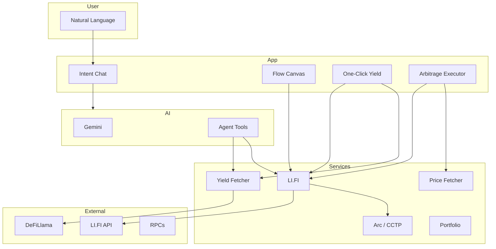
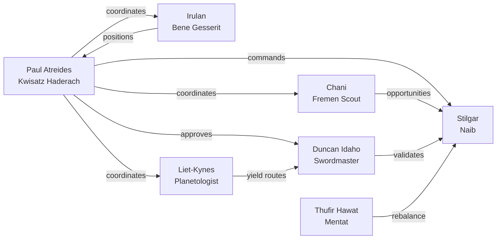

# LI.FI Agents Orchestrator

> Intent-driven cross-chain DeFi. Say what you want—agents and LI.FI handle execution.  
> **HackMoney 2026 · LI.FI Track**

---

## What It Does

| You Say | System Does |
|---------|-------------|
| *"Check my wallet"* | USDC balance across 6 chains |
| *"Swap 100 USDC from Ethereum to Arbitrum"* | Best route (Arc/CCTP), quote |
| *"Put my USDC where it earns the most"* | Scans DeFiLlama, finds best APY, executes |
| *"Find arbitrage opportunities"* | Cross-chain price gaps, profitable routes |
| *"Make best use of 1 USDC from my wallet"* | Balance + yields → optimal action |

Chains become an implementation detail. No forms, no jargon.

---

## Agent Hierarchy

Paul Atreides (Commander) sits at the top. Specialists report to him; validation gates execution.

| Level | Agent | Role | Function |
|-------|-------|------|----------|
| **1** | Paul Atreides | Kwisatz Haderach | Coordinates, approves routes |
| **2** | Chani | Fremen Scout | Arbitrage detection |
| **2** | Irulan | Bene Gesserit | Positions, PnL, history |
| **2** | Liet-Kynes | Planetologist | Yield opportunities |
| **3** | Duncan Idaho | Swordmaster | Route validation |
| **3** | Thufir Hawat | Mentat | Allocations, rebalancing |
| **4** | Stilgar | Naib | Execution |

---

## Intent → Agent Flow

Each intent maps to a subset of agents and a specific flow:

| Intent | Agents | Flow |
|--------|--------|------|
| Yield | a0, a3, a4, a6 | Paul → Liet-Kynes → Duncan → Stilgar |
| Arbitrage | a0, a1, a4, a6 | Paul → Chani → Duncan → Stilgar |
| Rebalancing | a0, a2, a5, a6 | Paul → Irulan → Thufir → Stilgar |
| Swap / Bridge | a0, a4, a6 | Paul → Duncan → Stilgar |
| Portfolio Check | a2 | Irulan only |

---

## Architecture

### System Architecture



### Agent Coordination



### Execution Flow

```
Paul Atreides (a0) ← USER INTENT
        │
        ├──► Chani (a1) ─────────┐
        ├──► Irulan (a2) ────────┼──► Duncan Idaho (a4) ──► Stilgar (a6) ──► LI.FI
        └──► Liet-Kynes (a3) ────┘           ▲
                                            │
                    Thufir Hawat (a5) ◄─────┘
```

---

## Quick Start

```bash
npm install
```

Create `.env`:

```env
VITE_GEMINI_API_KEY=your_gemini_key
VITE_LIFI_API_KEY=your_lifi_key  # optional, avoids rate limits
```

```bash
npm run dev
```

Open **http://localhost:3000**

---

## Tech Stack

| Layer | Stack |
|-------|-------|
| Frontend | React, Vite, TypeScript |
| AI | Gemini |
| DeFi | LI.FI SDK, Arc (CCTP), DeFiLlama |
| Wallet | Wagmi, Viem |

---

## Acknowledgments

- **LI.FI** — Cross-chain routing
- **Circle** — Arc / CCTP for native USDC
- **DeFiLlama** — Yield data
- **Google Gemini** — Intent parsing

UI inspired from aslan agents done by V0 
